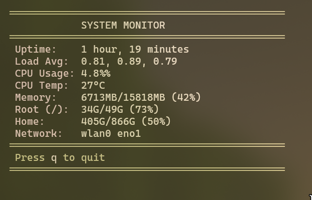

# 🖥️ System Monitor

Powerful and elegant real-time monitoring of the Linux system with a beautiful command line interface. Get complete information about the status of your system in one place
---

## ✨ Features

- **📊 Real-time monitoring of CPU usage**
- **💾 Memory and disk usage** with visual indicators
- **🌐 Network interfaces** and traffic statistics
- **🌡️ Temperature monitoring** of system components
- **⚡ Automatic installation of dependencies**
- **🔄 Cross-distribution support** for major Linux systems

---

# 🚀 Installation

**Installation is simple and fast**

### Clone the repository
**git clone** https://github.com/k9iqinee/System-monitoring-cli

### Go to the project directory
**cd System-monitoring-cli**

### Grant execution rights
**chmod +x sys.sh**

### Start the monitor
**./sys.sh**

 

## 🎯 How Using

**After startup, the monitor immediately starts displaying system statistics. The interface is intuitive and organized for easy reading.**

- Hot keybinding:

- q - leave from program

## 📦 Dependencies
- **The program will automatically install the necessary dependencies.**

- procps (for system information)

- util-linux (Linux utilities)

- iproute2 (network statistics)

## 📚The main dependencies:
- **procps** (process package)
- **ps** - information about the processes

- **free** - Memory usage monitoring

- **vmstat** - virtual memory statistics

- **top/htop** - process monitoring (alternatives)

- **util-linux** (system utilities) information about disk space usage

- **lsblk** - information about block devices

- **uptime** - the operating time of the system

- **lscpu** - information about the CPU

- **iproute2** - (network utilities)
- **ip** - a modern replacement for ifconfig

- **ss** - socket statistics (replacing netstat)

- **tc** - traffic control

- **Additional utilities** (optional): sensors (lm-sensors) - temperature monitoring

- **nvidia-smi** - NVIDIA GPU monitoring

- **smartctl** (smartmontools) - disk health monitoring

## ✅ Full supported
- **Debian** based  
- **RHEL** based 
- **Arch** based 
- **Opensuse** based
- **Gentoo**

## ⚡ Automatic installation

- **apt**  for Debian/Ubuntu

- **yum/dnf** for RHEL/CentOS/Fedora

- **pacman** for Arch Linux

- **zypper** for openSUSE

## 👥 The authors

- **k9iqinee** - Creator and main developer

## 🙏Thanks

- To the Linux community for the excellent tools and documentation.

- To the developers of system utilities for their invaluable contribution

- To all testers for feedback and bug reports

 - To the open-source community for their inspiration and support

#

